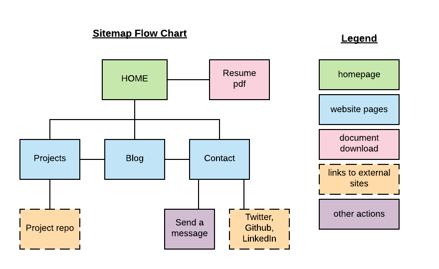
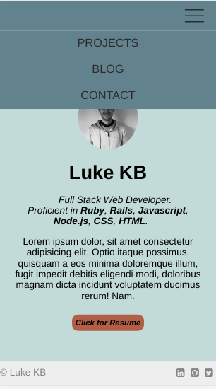
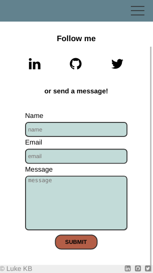
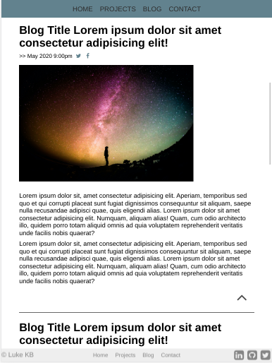
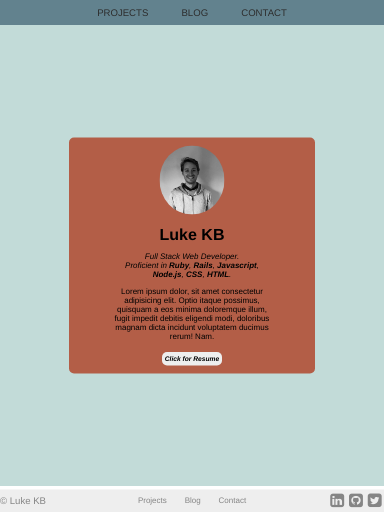

# T1A3 Portfolio Website

- [Link to website](https://luke-kb.netlify.app/)

- [Link to Repo](https://github.com/Luke-kb/portfolio)

[TOC]

### Purpose

The purpose for this project was to practice deploying a responsive, static website and demonstrate HTML layout and CSS and styling skills wthin a portfolio format and theme. Currently a proof-of-concept to be further developed in future.

### Functionality / Features

The website is responsive for mobile, tablet and desktop screens and utilises some simple CSS animations. There are 4 main html pages: homepage/index, projects, blog and a contact page. There is a contact form (not currently functioning), a link to download a resume in .pdf format (mockup) and social icon links to share blog posts (not currently functioning).

### Sitemap

### Screenshots

### Target Audience

Potential employers, peers and mentors.

### Tech stack

- HTML & CSS3
- Deployed on Netlify
- Code hosted on GitHub

### Links

- [Link to website](https://luke-kb.netlify.app/)

- [Link to Repo](https://github.com/Luke-kb/portfolio)